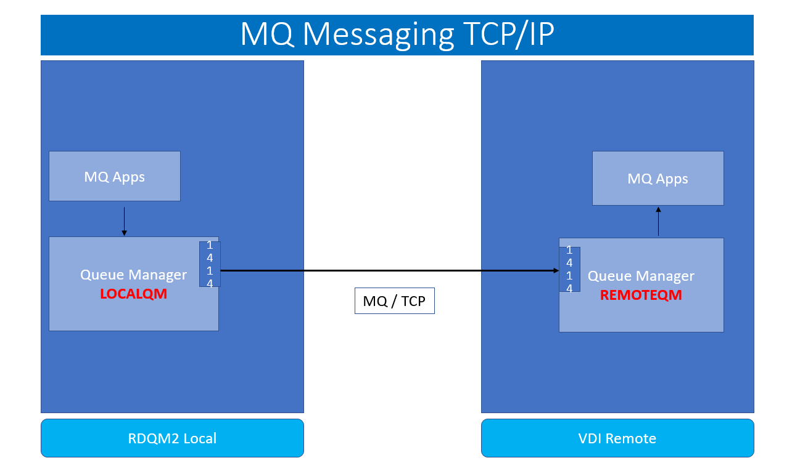
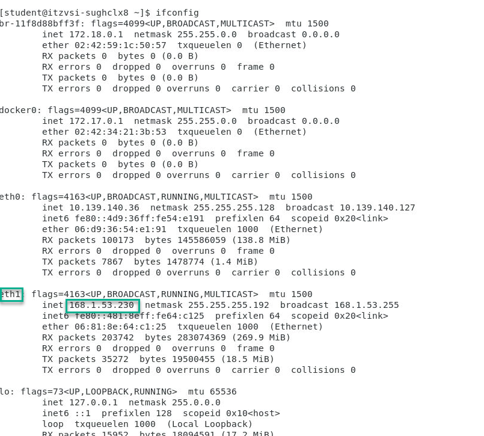
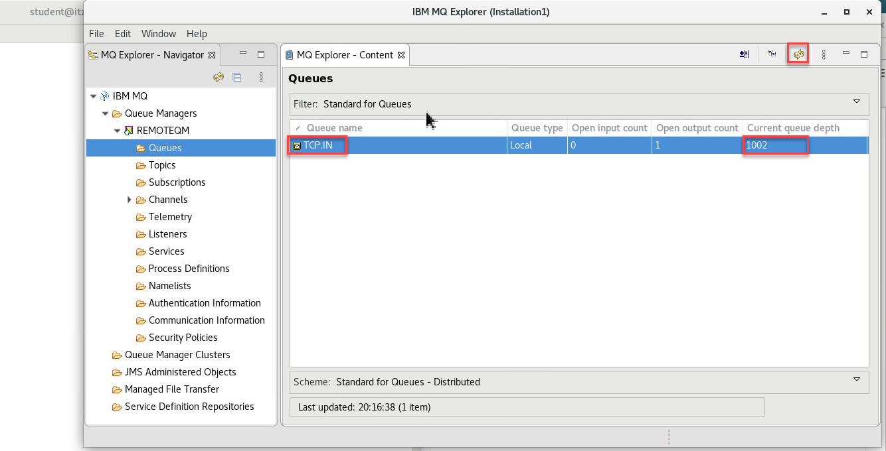
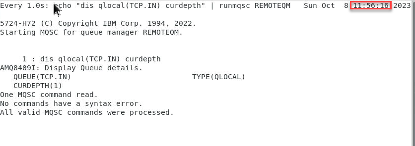
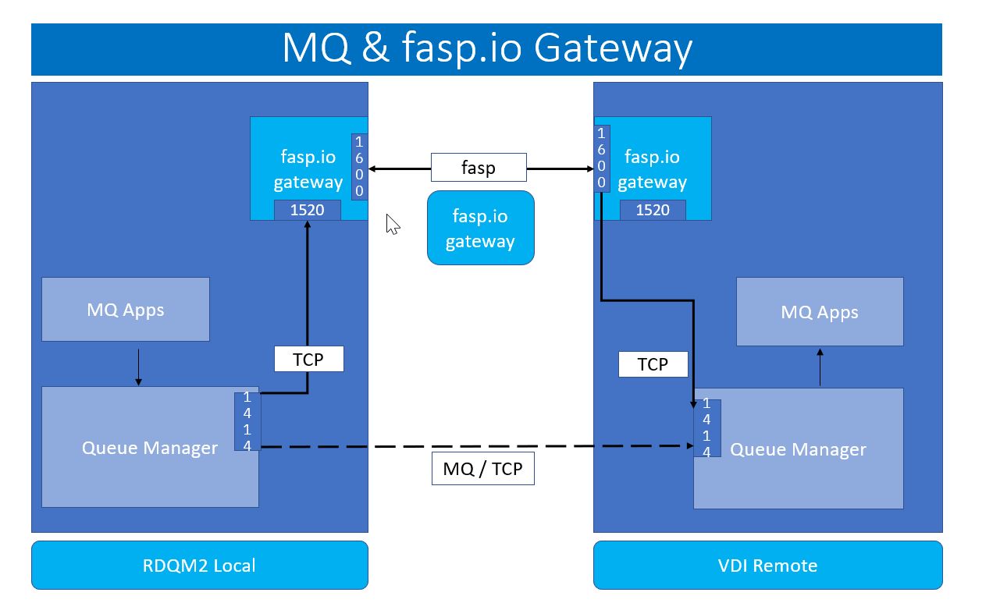
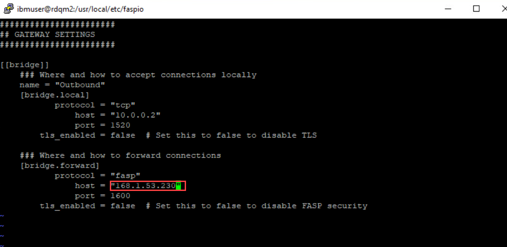
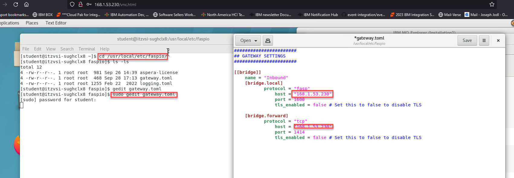

# IBM MQ Messaging & Aspera FASP.IO Gateway

## 1. Overview

The purpose of this lab to demonostrate the benefit of using Aspera fasp.io Gateway with IBM MQ over TCP.

At a high level, we will be using two VM's, one in Washington DC-United States, and another in London-United Kingdom.

You will be testing two usecases. 
<br>
a) Send large messages with MQ with TCP <br>
b) Send large messages with MQ with FASP over TCP
<br>

set firewall 

<br>

## 2. MQ Messaging TCP/IP Setup and testing 



### 2.1 Create the REMOTEQM on the VDI assigned to you.

1. When you first login to the VDI this will be considered your REMOTEQM.   We will need to add ports to the firewall and start it.   

    **NOTE:** You will need to use sudo so will use the password for that which was used to sign in. 

    ```
    sudo firewall-cmd --add-port=1414/tcp
    
    sudo firewall-cmd --add-port=1600/udp

    sudo systemctl start firewalld
    ```

1. You will need to capture the ip address of the REMOTEQM server.  This will be used when we setup the channel on the LOCALQM.

    Run the following command and save the IP address for eth1.

    ```
      ifconfig
    ```
    

1. Now we will create and start the QMgrs.  
  On the VDI that was assigned to you we will create the remote Qmgr. 
  
   Run the following commands to create and start the QMgr.

    ```
      crtmqm REMOTEQM

      strmqm REMOTEQM 
    ```
1. We will now use the **runmqsc** command to create the needed objects. 

    ```
    runmqsc REMOTEQM
    ``````

1. Now copy the following commands to the command line in runmqsc.
    ```
    alter qmgr chlauth(disabled)
    alter qmgr connauth(' ')
    refresh security (*) 

    def listener(listener.1414) trptype(tcp) port(1414) control(qmgr)

    start listener(listener.1414)

    dis lsstatus(listener.1414)

    def chl(LOCAL.REMOTE) chltype(rcvr)

    def qlocal(TCP.IN) maxdepth(100000) maxmsgl(104857600)
    ```
### 2.2 Create the LOCALQM on the RDQM2 node

1. When you login to RDRQM2 node this will be considered your LOCALQM.   We will need to add ports to the firewall and start it.   

    **NOTE:** You will need to use sudo so will use the password for that which was used to sign in. 

    ```
    sudo firewall-cmd --add-port=1414/tcp
    
    sudo firewall-cmd --add-port=1520/udp

    sudo firewall-cmd --add-port=1600/udp

    sudo systemctl start firewalld
    ```
1. Now we will create and start the QMgrs on the RDQM2 node we will create the local Qmgr. 

    Run the following commands to create and start the QMgr.

    ```
    crtmqm LOCALQM

    strmqm LOCALQM
    ```
1. We will now use the **runmqsc** command to create the needed objects. 

    ```
    runmqsc LOCALQM
    ```
1. Now copy the following commands from the command line in runmqsc.

    ```
    alter qmgr chlauth(disabled)
    alter qmgr connauth(' ')
    refresh security (*) 

    def listener(listener.1414) trptype(tcp) port(1414) control(qmgr)

    start listener(listener.1414)

    dis lsstatus(listener.1414)

    DEF QLOCAL(REMOTE) USAGE(XMITQ) INITQ(SYSTEM.CHANNEL.INITQ) TRIGDATA(WDC.LDN)

    def qremote(REMOTE.TCP.IN) rname(TCP.IN) rqmname(REMOTEQM) xmitq(REMOTE)
    ```
1. Now for defining the Sender channel you will need to replace the yy.yy.yy.yy with the ip you saved from the VDI in the last section. 

    ```  
    def chl(LOCAL.REMOTE) chltype(sdr) conname('168.1.53.230(1414)') XMITQ(REMOTE)
    ```
1. Now we will start the channel and check the channel status. 

    ```
      START CHL(LOCAL.REMOTE)

      dis chstatus(LOCAL.REMOTE)
    ```

### 3.0 Test the Channel Connectivity</b>

1. Now we will test to make sure that the MQ TCP/IP channels are working between the QMgrs. 

    On the **rdqm2** local Qmgr put a test message. 
    ```
   /opt/mqm/samp/bin/amqsput REMOTE.TCP.IN LOCALQM
    ```
1. Go to the REMOTEQM running on the VDI and you can use MQ Explorer to view queues or run the following command. 

    ```
     /opt/mqm/samp/bin/amqsget TCP.IN REMOTEQM
    ```
    

### 3.1 Check timing on blast of 1000 messages. 

1. Now we will setup a watch on the REMOTEQM on the VDI to monitor how long it takes to get messages. 

    ```
    watch -n 1 'echo "dis qlocal(TCP.IN) curdepth" | runmqsc REMOTEQM'
    ```
      

1. Now we will Blast 1000 messages (1MB each) on the rdqm2 LOCALQM.  

   **NOTE:** Check clock before blasting messages.

    ```
    amqsblst LOCALQM REMOTE.TCP.IN -W -s 1048576  -c 1000
    ```
1. WRITE DOWN THE TIME TAKEN TO TRANSFER 1000 MESSAGES TO REMOTEQM TCP.IN queue.

    **Note: Should be around 3:00 minutes. 

## 4. Configure fasp.io Gateway
Now we will configure the **fasp.io** gateway to see the time it takes to move messages to the RemoteQM



### 4.1 LOCALQM on rdqm2 VM

1. Update gateway.toml

    ```
    sudo vi /usr/local/etc/faspio/gateway.toml
    ```

1. You will only need to change the **Forward IP** to match the IP of the VDI. 

    


### 4.2 REMOTEQM on VDI

1. Update gateway.toml

   You will change both IPs to match the IP of the VDI. 

    

### 4.3 Start fasp.io gateway

1. Run the following commands on both the rdqm2 node and the VDI. 

    ```
    systemctl enable faspio-gateway

    systemctl start faspio-gateway

    systemctl status faspio-gateway
    ```

    **Note:** Make sure the fasp.io gateway is started successfully. 

## 5. MQ & FASP Setup and Testing
<br>

## 5.1 Creating MQ Definitions

### 5.1.1 VDI REMOTEQM setup

1. On the VDI run the following commands to create the needed MQ objects.  First run the runmqsc command 

    ```
    runmqsc REMOTEQM
    ```
1. Copy and paste the following commands.  

    ```
    def chl(LOCAL.REMOTE.FASP) chltype(rcvr)
    def qlocal(FASP.IN) maxdepth(100000) maxmsgl(104857600)
    ```
### 5.1.2 rdqm2 node LOCALQM setup

1. On the rdqm2 node run the following commands to create the needed MQ objects.  First run the runmqsc command 

    ```
    runmqsc LOCALQM
    ```
1. Copy and paste the followng commands.  

    **NOTE** Make sure to change the conname IP address to match your VDI IP.
    ```
    Define channel(LOCAL.REMOTE.FASP) chltype(sdr) conname('168.1.53.230(1520)') xmitq(REMOTE.FASP) 

    DEF QLOCAL(REMOTE.FASP) USAGE(XMITQ) INITQ(SYSTEM.CHANNEL.INITQ) TRIGDATA(LOCAL.REMOTE.FASP)

    def qremote(REMOTE.FASP.IN) rname(FASP.IN) rqmname(REMOTEQM) xmitq(REMOTE.FASP)

    def listener(listener.1520) trptype(tcp) port(1520) control(qmgr)

    start listener(listener.1520)
    ```
1. Now run the following two commands to start channel and check status. 
    ``` 
    START CHL(LOCAL.REMOTE.FASP)

    Dis chstatus(LOCAL.REMOTE.FASP)
    ```

### 5.2 Testing

<table>
    <thead>
      <tr>
        <th>LONDON</th>
        <th>WASHINGTON</th>
      </tr>
    </thead>
    <tbody>
        <tr>
            <td>watch -n 1 'echo "dis qlocal(fasp.in) curdepth" | runmqsc QMLDND01'</td>
            <td>amqsblst QMWDCD01 QR.LDN.FASP.IN -W -s 1048576  -c 1000

watch -n 1 'echo "dis qlocal(xmitq.QMLDND01.FASP) curdepth" | runmqsc QMWDCD01'
</td>
        </tr>
    </tbody>
  </table>


<br>
<b>Note: <br>
WRITE DOWN THE TIME TAKEN TO TRANSFER 1000 MESSAGES TO LONDON FASP.IN queue. OBSERVE THE DIFFERENCE between a TCP Transfer & a FASP Transfer.</b><br>
<br>
You should see 60-65% better performance using Aspera fasp.io gateway.
<br>
<br><br>


# Congratulations !!! 

