# Lab 2 - Streaming Queues for MQ on CP4I
## Notes
To add to lab 

disabled the CHLAUTH

alter qmgr connauth(' ')

refresh security (*)

you need to enter some message manually (edited) 
its different from amqsphac and ghac


## Introduction

This lab demonstrates the Streaming Queue feature added to MQ in the 9.2.3.0 CD release.
Streaming Queues allow you to configure any local or model queue with the name of second named queue. This second queue is referred to as a Stream Queue. 

When messages are put to the original queue, a duplicate copy of each message is also placed on the stream queue. The Streaming Queue feature allows you to create a duplicate stream of messages which can be used for later analysis, logging, or storage without affecting the business applications using the original queue.

### Lab Objectives

In this lab, you will:

* Create two queues. An application queue that messages are put to by a sending application, and a stream queue for duplicate messages to be streamed to
* Configure the application queue to stream messages to the stream queue
* Send messages to the application queue and observe them being duplicated to the stream queue
* Modify the stream queue and the streaming quality of service to demonstrate the behaviour when duplicate messages cannot be streamed
* Inspect some of the messages to see that they are identical

We will not demonstrate messages being consumed from either of the queues. Stream queues are regular MQ local queues and getting messages from them
is done in the same way as any other MQ queue.

We will not demonstrate using a queue alias to topic as the stream queue, although this is supported. More information on using a queue alias as the streamqueue is available in the IBM Documentation.

### Acknowledgements
This lab was written by Matthew Whitehead (mwhitehead@uk.ibm.com).

[Streaming Queues in IBM Knowledge Center](hhttps://www.ibm.com/docs/en/ibm-mq/9.2?topic=scenarios-streaming-queues)

## Background 

Topology overview for stream queues

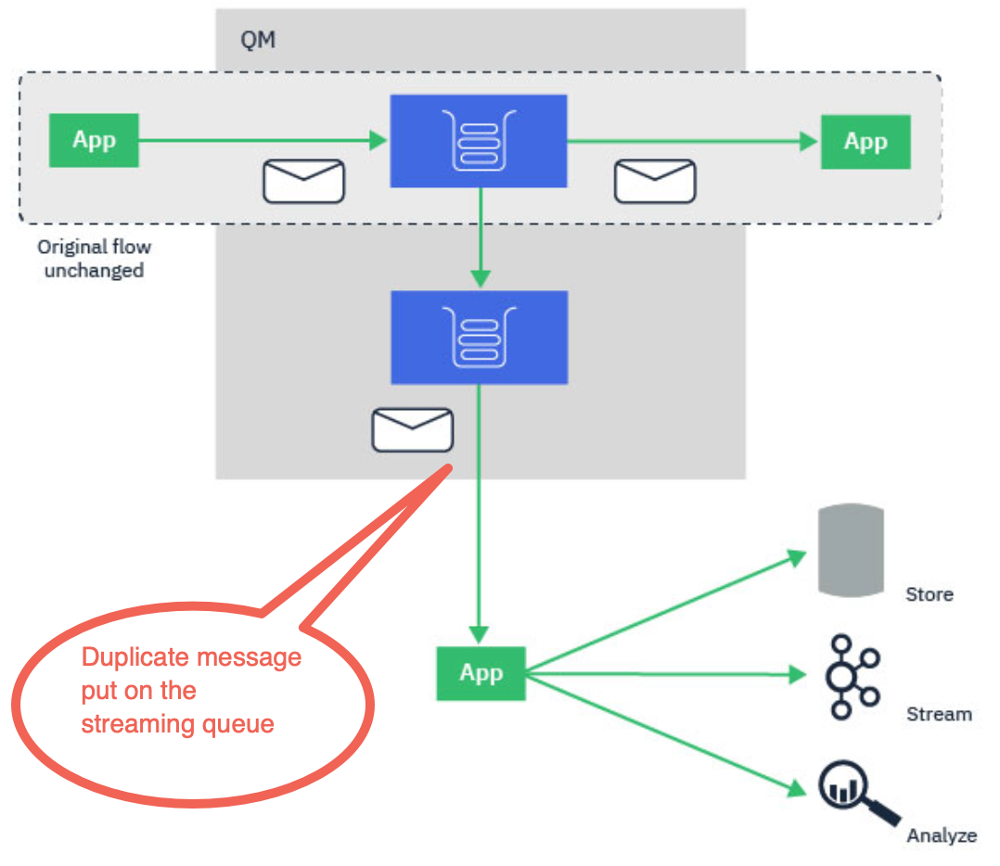

The topology diagram shows the basic capability of stream queues. A regular local queue that is currently being used by MQ applications can be configured to stream a duplicate of every message put to that queue, to a second destination called a stream queue.

The streaming queues feature of IBM® MQ is configured by the administrator on individual queues, and the messages are streamed by the queue manager, not by the application itself.

This means that in almost all cases the application putting messages to the original queue is completely unaware that streaming is taking place. Similarly, the application consuming messages from the original queue is unaware that message streaming has taken place. 

**The version of the IBM MQ client library does not need upgrading to make use of streaming queues, and the original messages are completely unchanged by the streaming process.**

You can configure streaming queues in one of two modes:

* Best effort
    
    In this mode, the queue manager considers it more important that delivery of the original message is not affected by delivery of the streamed message. 
    If the original message can be delivered, but the streamed message cannot, the original message is still delivered to its queue. This mode is best suited to those applications, where it is important for the original business application to remain unaffected by the streaming process.
    
* Must duplicate
    
    In this mode, the queue manager ensures that both the original message and the streamed message are successfully delivered to their queues. 
    If, for some reason, the streamed message cannot be delivered to its queue, for example, because the second queue is full, then the original message is not delivered to its queue either. The putting application receives an error reason code and must try to put the message again. 

### Streamed messages

In most cases, the copy of the message delivered to the second queue is a duplicate of the original message. This includes all of the message descriptor fields, including the message ID and correlation ID. The streamed messages are intended to be very close copies of the original messages, so that they are easier to find and, if necessary, replay them back into another IBM MQ system.

There are some message descriptor fields that are not retained on the streamed message. The following changes are made to the streamed message before it is placed on the second queue:

* The expiry of the streamed message is set to MQEI_UNLIMITED, regardless of the expiry of the original message. If CAPEXPRY has been configured on the secondary queue this value is applied to the streamed message.
   
* If any of the following report options are set on the original message, they are not enabled on the streamed message. This is to ensure that no unexpected report messages are delivered to applications that are not designed to receive them:  

	* Activity reports
   * Expiration reports
   * Exception reports

Due to the near-identical nature of the streamed messages, most of the attributes of the secondary queue have no affect on the message descriptor fields of the streamed message. For example, the DEFPSIST and DEFPRTY attributes of the secondary queue have no affect on the streamed message.

The following exceptions apply to the streamed message:

* CAPEXPRY set on the CUSTOM attribute

    If the secondary queue has been configured with a CAPEXPRY value in the CUSTOM attribute, this expiry cap is applied to the expiry of the streamed message.
   
* DEFBIND for cluster queues

    If the secondary queue is a cluster queue, the streamed message is put using the bind option set in the DEFBIND attribute of the secondary queue.

### Streaming queue restrictions

Certain configurations are not supported when using streaming queues in IBM® MQ, and these are documented here.

The following list specifies the configurations that are not supported:

* Defining a chain of queues streaming to each other, for example, Q1->Q2, Q2->Q3, Q3->Q4
* Defining a loop of streaming queues, for example, Q1->Q2, Q2->Q1
* Defining a subscription with a provided destination, where that destination has a STREAMQ defined
* Defining STREAMQ on a queue configured with USAGE(XMITQ)
* Modifying the STREAMQ attribute of a dynamic queue
* Setting STREAMQ to any value that begins SYSTEM.*, except for SYSTEM.DEFAULT.LOCAL.QUEUE
* Defining STREAMQ on any queue named SYSTEM.*, with the following exceptions:
        
  * SYSTEM.DEFAULT.LOCAL.QUEUE
  * SYSTEM.ADMIN.ACCOUNTING.QUEUE
  * SYSTEM.ADMIN.ACTIVITY.QUEUE
  * SYSTEM.ADMIN.CHANNEL.EVENT
  * SYSTEM.ADMIN.COMMAND.EVENT
  * SYSTEM.ADMIN.CONFIG.EVENT
  * SYSTEM.ADMIN.LOGGER.EVENT
  * SYSTEM.ADMIN.PERFM.EVENT
  * *SYSTEM.ADMIN.PUBSUB.EVENT
  * SYSTEM.ADMIN.QMGR.EVENT
  * SYSTEM.ADMIN.STATISTICS.QUEUE
  * SYSTEM.DEFAULT.MODEL.QUEUE
  * SYSTEM.JMS.TEMP.QUEUE

* Setting STREAMQ to the name of a model queue

### Stream queues and transactions

The streaming queues feature allows a message put to one queue, to be duplicated to a second queue. In most cases the two messages are put to their respective queues under a unit of work.

If the original message was put using MQPMO_SYNCPOINT, the duplicate message is put to the stream queue under the same unit of work that was started for the original put.

If the original was put with MQPMO_NO_SYNCPOINT, a unit of work will be started even though the original put did not request one. This is done for two reasons:

1. It ensures the duplicate message is not delivered if the original message could not be. The streaming queues feature only delivers messages to stream queues if the original message was also delivered.
    
1. There can be a performance improvement by doing both puts inside a unit of work

The only time the messages are not delivered inside a unit of work is when the original MQPUT is non-persistent with MQPMO_NO_SYNCPOINT, and the STRMQOS attribute of the queue is set to BESTEF (best effort).

**The additional put to the stream queue does not count towards the MAXUMSGS limit.  In the case of a queue configured with STRMQOS(BESTEF), failure to deliver the duplicate message does not cause the unit of work to be rolled back.**

### Streaming to and from cluster queues

It is possible to stream messages from a local queue to a cluster queue and to stream messages from cluster queue instances to a local queue.

#### Streaming to a cluster queue

This can be useful if you have a local queue where original messages are delivered, and would like to stream a copy of every message to one or more instances of a cluster queue. This could be to workload balance the processing of the duplicate messages, or simply to have duplicate messages streamed to another queue elsewhere in the cluster.

When streaming messages to a cluster queue, messages are distributed using the cluster workload balancing algorithm. A cluster queue instance is chosen based on the DEFBIND attribute of the cluster queue.

For example, if the cluster queue is configured with DEFBIND(OPEN), an instance of the cluster queue is chosen when the original queue is opened. All duplicate messages go to the same cluster queue instance, until the original queue is reopened by the application.

If the cluster queue is configured with DEFBIND(NOTFIXED), an instance of the cluster queue will be chosen for every MQPUT operation.

**You should configure all cluster queue instances with the same value for the DEFBIND attribute.**

#### Streaming from a cluster queue

This can be useful if you already send messages to several instances of a cluster queue, and would like a copy of each message to be delivered to a streaming queue, on the same queue manager, as the cluster queue instance.

When the original message is delivered to one of the cluster queue instances, a duplicate message is delivered to the stream queue by the cluster-receiver channel.

## Run the lab

### Lab configuration

This lab was designed to be run on the RDQM Linux images as part of the MQ Advanced POT.
 
* The lab assumes MQ 9.2.3.0 installed to /opt/mqm and that the sample programs are available in /opt/mqm/samp/bin

**Entering commands for this lab - In this lab, you will come across some quite long commands to enter. You will be using Linux Shell like bash. To avoid a lot of typing, you may copy the commands from this document and execute on the Shell.**

### Define the StreamQ and add that to the SOURCE queue.
1. In this lab you will use the existing Queue Manager you created in lab 1 for RDQM lab.
We will run the following commands against the QMHA Queue Manager from lab 1. 

	```sh
	runmqsc QMHA
	```
	
	```sh
	define ql(STREAMQ)
	```
	
	```sh
	alter QL(SOURCE) streamq(STREAMQ)
	```
Now every message put to the **SOURCE** queue will have the same message put to the **STREAMQ** that we configured. 

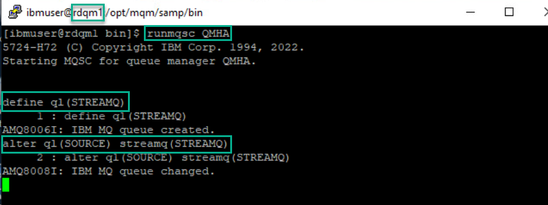
#### Put messages on the application queue
	
1. In the terminal window in the *./test* directory initiate the testing by running the following command:

	```sh
	./sendMessage.sh
	```
	
	The script will then connect to MQ and start sending messages incessantly. Leave this window open to keep sending messages.
	
	*sendMessage.sh* uses the amqsphac sample application shipped with MQ to put some messages to the application queue *APPQ*. 
	
   **The script will not put any messages directly to
MY.LOG.QUEUE – the queue manager will do that for us.**
	
	

1. After a number of messages have been put, end the script with <CTRL-C>. Leave the terminal window open.

#### Check to see if messages are on app queue and streaming queue
		
1. Return to the browser where the MQ Console is running. Click *Manage* > *Queues*. Scroll down if necessary to see all queues. Compare the number of messages for **APPQ** to the number of messages for its streaming queue **MY.LOG.QUEUE**. They should be the same.

	Note that even though we didn’t put any messages to *MY.LOG.QUEUE* it has the same number of messages on it as *APPQ*. The stream queue feature has taken a copy of each message we put to *APPQ* and streamed it to *MY.LOG.QUEUE*.

	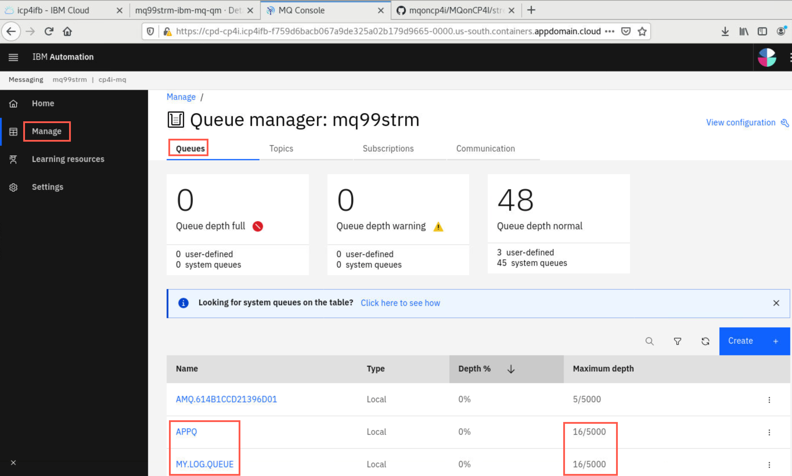

1. Open another command window, navigate to */home/student/mqoncp4i-master/MQonCP4I/streamq/test* directory and run the following command:

	```sh
	./getMessage.sh
	```
	
	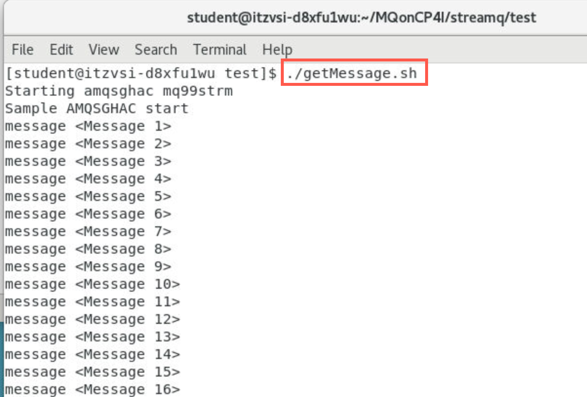
	
	When all messages have been read, end the script with <CTRL-C>. Leave the terminal window open.
	
1. Click *Storage* then *Edit*. 

	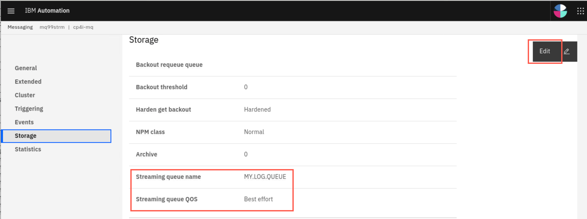
	
	 Note that the *Streaming queue Quality of Service (QOS)* is set to  **Best effort**. The **BESTEF** quality of service is the default value and indicates that MQ should attempt
to stream the duplicate messages to the stream queue but that it should deliver the original message to *APPQ* even if there is a problem delivering the duplicate. 

	This quality-of-service is best suited to applications where you want to make sure that the original behavior of the application is not affected by the stream queue feature. In this mode a putting application will never receive an error from the MQPUT API call due to an error with the streaming feature.

#### Change quality of service on streaming queue to must dup

1. Steam queues offer a second quality-of-service, **MUSTDUP** (must duplicate). When MUSTDUP is used, MQ will either deliver both messages, or neither
of them. If there is a problem delivering the duplicate to the stream queue then the original message will not be delivered to the application queue and the
putting application will receive an error reason code.
Let’s change our *APPQ* to use the MUSTDUP quality of service and see what affect that has.

	Click the dropdown for *Streaming queue QOS* and select **Must duplicate**. Click *Save*. 
	
	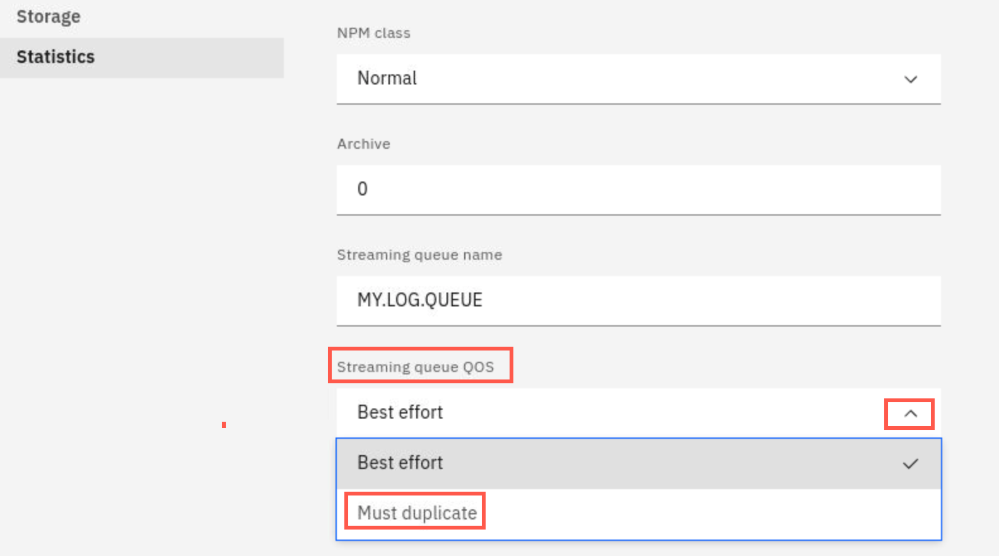


## Testing the SteamQ using HA sample programs

We will use the same sample programs that are provided with MQ, which we used in lab 1.  

* **amqsphac** - puts a sequence of messages to a queue with a two second delay between each message and displays events sent to its event handler. This will run on **rdqm3**.
* **amqsmhac** - copies messages from one queue to another with a default wait interval of 15 minutes after the last message that is received before the program finishes. This will run on **rdqm2**.
* **amqsghac** - gets messages from a queue and displays events sent to its event handler. This will run on **rdqm1**.


### Start the HA sample programs

The easiest way to configure access to the queue manager from the sample programs is to use the MQSERVER environment variable. Again, as there are 3 possible nodes where our queue manager could run, each needs to be specified, along with the listener port for the queue manager. 

1. On **rdqm1**, in the user ibmuser terminal window, enter:
	
	```
	export MQSERVER='CHANNEL1/TCP/10.0.1.1(1500),10.0.1.2(1500),10.0.1.3(1500)'
	```
	
1. Change to the **/opt/mqm/samp/bin** directory, and run the command: **amqsghac TARGET QMHA**
	
	```
	cd /opt/mqm/samp/bin
	./amqsghac TARGET QMHA
	```

	
	
	Later, this will display the messages generated by amqsphac on rdqm3.

	**Leave this command to run!**
	
1. Now switch to **rdqm2**. In the user ibmuser terminal window, enter:
	
	```
	export MQSERVER='CHANNEL1/TCP/10.0.1.1(1500),10.0.1.2(1500),10.0.1.3(1500)'
	```
1. Change directory to **/opt/mqm/samp/bin** and run the command: **amqsmhac -s SOURCE -t TARGET -m QMHA**


	```
	cd /opt/mqm/samp/bin
	./amqsmhac -s SOURCE -t TARGET -m QMHA
	```	
	
	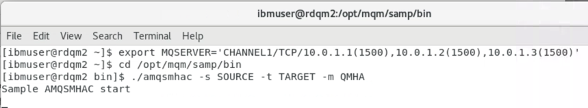
	
	**Leave this command to run!**
	
**NOTE:** If you are copying the command snippets from this lab guide and pasting them in the terminal windows: Beware that if the command does not work it may be that the copy assumes a long or double hyphen instead of a single hyphen. Just try overtyping the hyphen with the regular hyphen.
	
1. Now switch to **rdqm3**. As before open a new terminal window. As the user ibmuser enter:

	```
	export MQSERVER='CHANNEL1/TCP/10.0.1.1(1500),10.0.1.2(1500),10.0.1.3(1500)'
	```
	
1.	Change directory to **/opt/mqm/samp/bin** and run the command: **amqsphac SOURCE QMHA**

	```
	cd /opt/mqm/samp/bin
	./amqsphac SOURCE QMHA
	```	
	
	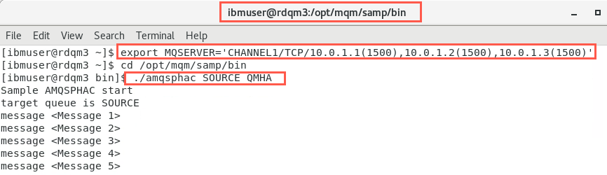
	
	**Leave this command to run!**

1. Confirm that these messages are also being displayed on **rdqm1**.

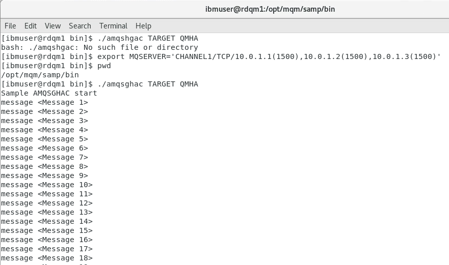

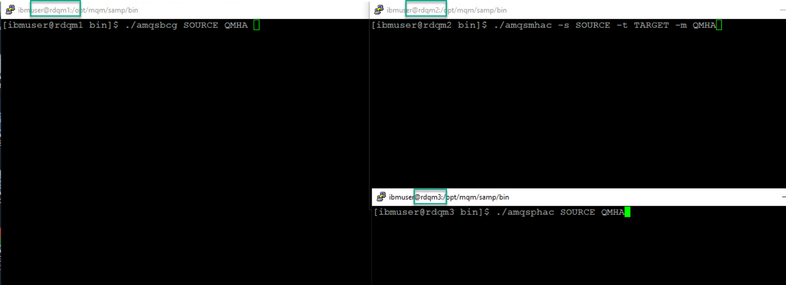

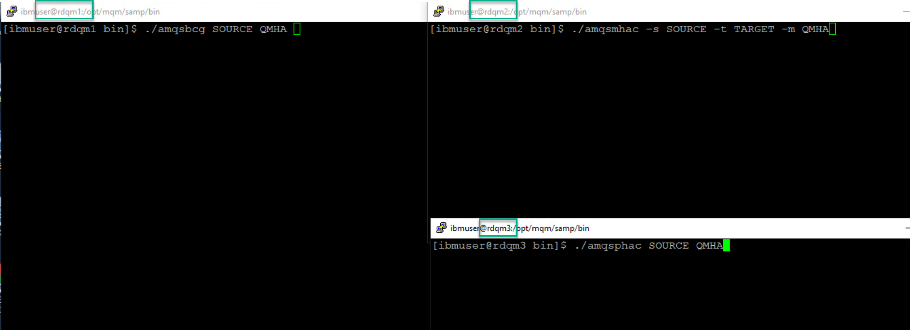

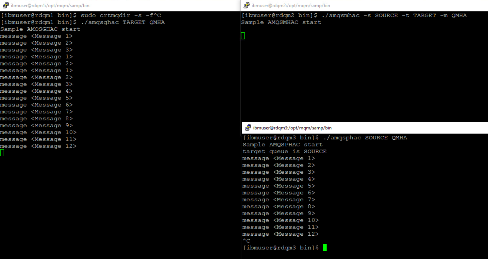
	
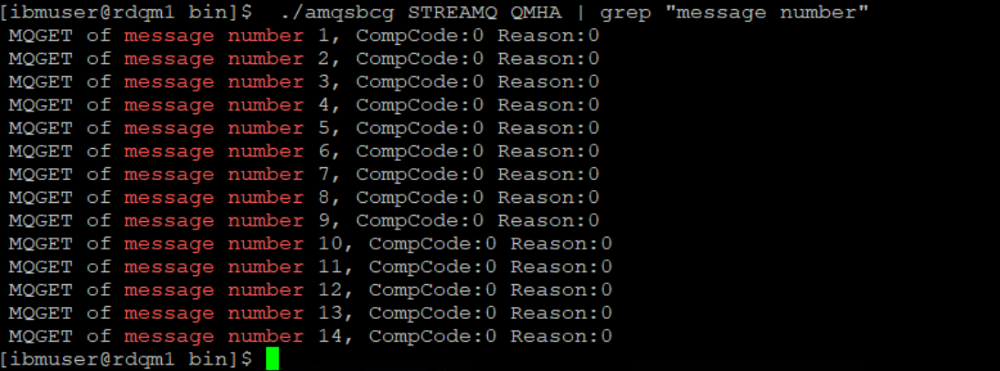
	
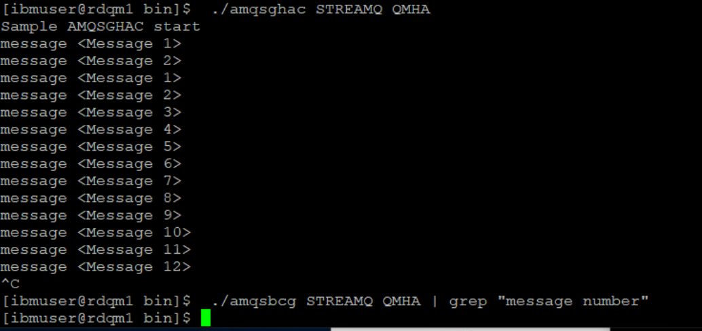
	
**Note:** At this stage, the queue manager is running on the primary node (rdqm1) and each sample program is able to communicate with it, using the first location specified in the MQSERVER environment variable:

CHANNEL1/TCP/**10.0.1.1(1500)**,10.0.1.2(1500),10.0.1.3(1500)


## Congratulations

You have completed this lab Streaming Queue for MQ on CP4I.

[Return MQ CP4I Menu](mq_cp4i_pot_overview.html)